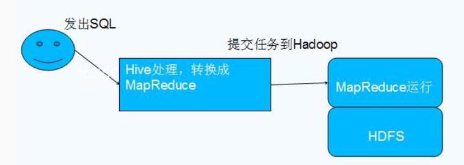
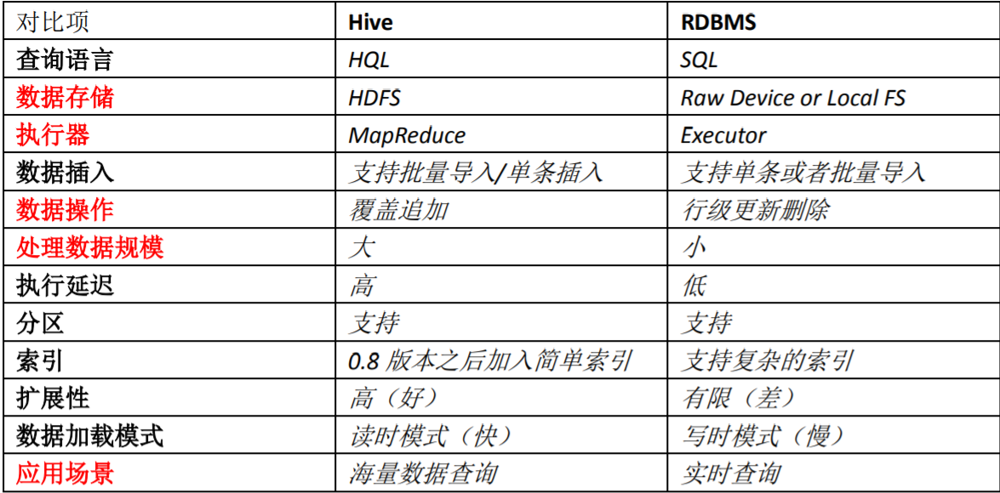
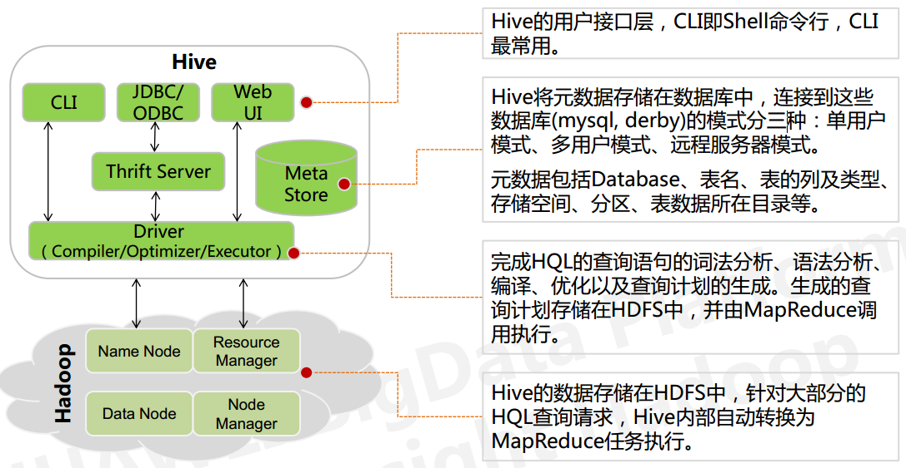

# 1 简介

## 1.1 什么是hive
1、Hive 由 Facebook 实现并开源

2、是基于 Hadoop 的一个数据仓库工具

3、可以将结构化的数据映射为一张数据库表

4、并提供 HQL(Hive SQL)查询功能

5、底层数据是存储在 HDFS 上

6、Hive的本质是将 SQL 语句转换为 MapReduce 任务运行

7、使不熟悉 MapReduce 的用户很方便地利用 HQL 处理和计算 HDFS 上的结构化的数据，适用于离线的批量数据计算。


Hive 依赖于 HDFS 存储数据，Hive 将 HQL 转换成 MapReduce 执行，所以说 Hive 是基于 Hadoop 的一个数据仓库工具，实质就是一款基于 HDFS 的 MapReduce 计算框架，对存储在 HDFS 中的数据进行分析和管理



## 1.2 hive特点
**优点**：

1. **可扩展性,横向扩展**，Hive 可以自由的扩展集群的规模，一般情况下不需要重启服务 横向扩展：通过分担压力的方式扩展集群的规模 纵向扩展：一台服务器cpu i7-6700k 4核心8线程，8核心16线程，内存64G => 128G
2. **延展性**，Hive 支持自定义函数，用户可以根据自己的需求来实现自己的函数
3. **良好的容错性**，可以保障即使有节点出现问题，SQL 语句仍可完成执行


**缺点**：

1. **Hive 不支持记录级别的增删改操作**，但是用户可以通过查询生成新表或者将查询结 果导入到文件中（当前选择的 hive-2.3.2 的版本支持记录级别的插入操作）
2. **Hive 的查询延时很严重**，因为 MapReduce Job 的启动过程消耗很长时间，所以不能 用在交互查询系统中。
3. **Hive 不支持事务**（因为不没有增删改，所以主要用来做 OLAP（联机分析处理），而 不是 OLTP（联机事务处理），这就是数据处理的两大级别）。


## 1.3 和关系型数据库对比



总结： 
	Hive 具有 SQL 数据库的外表，但应用场景完全不同，**Hive 只适合用来做海量离线数 据统计分析，也就是数据仓库**。


## 1.4 hive架构




# 2 常用语法

1. 登录
```sql
hive;
```

2. 退出
```sql
quit;
```


```sql
exit;
--exit会影响之前的使用，所以需要下一句kill掉hadoop的进程
hadoop job -kill jobid
```


3. 选择使用哪个数据库
```
hive> use database_name;    --使用哪个数据库
```
4. 查看数据表结构
```

hive> describe tab_name; or desc tab_name;   --查看表的结构及表的路径
```

5. 查看数据库的描述及路径
```

hive> describe database database_name; 
or
hive> desc database database_name;
 --查看数据库的描述及路径
```


1、hive模糊搜索表
```
show tables like '*NAME*';
```
2、查看表结构信息
```
desc formatted TABLE_NAME;
desc TABLE_NAME
desc extended TABLE_NAME
```

3、查看分区信息
```
show partitions TABLE_NAME;
```
4、根据分区查询数据
```
select table_coulm from tablename where partitionname = '2016-02-25';
```

```sql
SELECT
    address_1,
    city_name,
    state_name,
    postal_area_code
FROM
    postal_address
WHERE
    account_id =
```