# 1 人物信息

## 1.1 参考资料

# 2 职业信息
## 2.1 转职路线

## 2.2 转职道具

太阳腕轮（男主角用）
月亮腕轮（女主角用）  
骑士证书（轻骑、重甲用）
英雄之证（斧战士、佣兵、剑士用）  
天空之鞭（天马、龙骑用）
霸者之证（海盗、盗贼用）  
指引指环（所有魔法类职业用）
射手之箭（弓手用）  
统帅之证（所有初级职业用）

## 2.3 高级职业特技

刺客：瞬杀，对手即死，发动条件为发动必杀一击时概率乘以50%，（如果必杀率为36%，那么瞬杀发动概率为18%）  
即使普通攻击为NODAMAGE，瞬杀发动后对手一样即死（一个‘力’12的刺客砍‘防’30的将军，第一下发动必杀，NODAMAGE，追击时发动瞬杀，将军即死，这就是区别），可以理解为瞬杀效果是对手生命直接减为0，与攻击力无关  

将军：大盾，完全防御一切攻击，发动概率为对手的等级乘以100%（如果对方13级时，有13%几率发动，对方等级越高几率越大）  

狙击手：必的，必定命中，发动概率为自己的等级乘以100%，自己等级越高几率越大  

翼龙骑士：贯通，无视防御的攻击，即忽略对手防御力对自己攻击的削弱，发动概率为自己的等级乘以100%，同样是自己等级越高几率越大  

侠盗：开锁，一切门、宝箱可以直接打开，不需要钥匙~  

祭司：魔物特效，祭祀对魔物攻击时攻击力乘以2  

召唤师：召唤，召唤亡灵战士，亡灵战士能力中生命恒为1，幸运恒为0，其他能力和召唤者的等级有关，所持武器是随机的斧系武器（有可能拿个必杀斧，不过不能扒下来给别人用……）  
召唤时身边必须有空位~而且最多只能同时存在一个亡灵战士，反正是诱饵，死了再招就是~  

顺便说一下，当瞬杀、贯通、必的这些攻击特技遇上大盾时，会被大盾完全防御！不过很少见这种情况就是了……  
另外，剑圣、狂战士、高级见习都有必杀+15%的职业加成；盗贼、刺客、侠盗有在浓雾中视野范围为10的特殊能力。

## 2.4 高级职业评价

圣骑士：力技速防发展全面，可使用多种武器和高机动性使其可以适应绝大部分环境，在各种战斗中都是强有力的队友。  
总体评价：★★★★★  

重骑士：力防高于圣骑且可以用斧，但是技速有所不及，移动力也稍次。两个有强力支援的圣骑重骑配合的话，在攻坚和防守战中效果突出。  
总体评价;★★★★  

将军：特技“大盾”和突出的防御力造就一座不折不扣的移动堡垒，不过他的速度和移动力实在是……（天生欠揍）比较被动的职业，不用他不行的情况很少出现。  
总体评价：★★★  

狙击手：命中的达人，不受武器克制的干扰使得攻击输出十分稳定，而且对飞行系有特效；不能反击近身攻击是其弱点，需要阵型和配合才能发挥最大战力。  
总体评价：★★★★  

丛林骑兵：比起狙击手的稳定输出尚有不及，在高机动部队中作为优秀的二线攻击输出存在，能使用剑也避免了弓箭手不能近战的尴尬，没有明显缺点的职业。  
总体评价：★★★☆  

独角兽骑士：优秀的速运魔防以及飞行系不受地形限制的优势使得其后劲十足，不过生命普遍不太高，满血都有可能被弓箭手秒掉……  
总体评价：★★★★  

龙骑统帅：和将军相比要实用的太多的空中堡垒，力防优秀且技速均衡，可以很好的压制弓系和魔法系以外的兵种，如果有护天之符，那简直可以横着走了……  
总体评价：★★★★☆  

翼龙骑士：性能和龙骑统帅相差无几，不过适应性略低，且更加注重攻击输出，贯通的存在使其有可能秒杀对手。  
总体评价：★★★★  

斧勇士：生存能力和适应性都不高的职业，只有在对枪系敌人时才能发挥出效果，速度不高使其容易被追击，虽然可以用弓但是伤害输出远远没有弓手稳定，总之，初期还有人用用作辅助，重要战斗没他的份……  
总体评价：★★☆  

狂战士：虽然只能用斧，但是高力速和必杀附加使其有秒杀绝大部分职业的恐怖能力，60封顶的生命也抗不住狂战士的必杀一击，而且是地面高级兵种中唯一能上山下海增加自身的回避防御的职业，适用范围虽然略窄但是能力突出。  
总体评价：★★★★☆  

勇者：多武器使用和优秀的力技速防使其在阵地战中十分犀利，和圣骑一样是极为可靠的一线战力。  
总体评价：★★★★☆  

剑圣：极为优秀的技速和必杀加成使其成为当之无愧的BOSS杀手，论单挑能力永远是排在第一位的，虽然在后期对枪系高级职业有些吃力，但是支援和地形能很好的弥补这一点。  
总体评价：★★★★★  

刺客：和剑圣同样犀利的杀手型职业，不过偏低的力防增加了他的使用难度，而且瞬杀的发动机率实在是不高……适用性也偏低，大规模战斗时会比较尴尬。  
总体评价：★★★★  

侠盗：就是盗贼的升级版，游戏进程中会加入一名，实在没有再转一个的必要……战斗能力不高，不过继承盗贼的那些特殊技能还是很好用的，可以队伍养成时期偷钱挖宝补充军资~必不可少的辅助人员  
总体评价：★★★  

贤者：能力最平衡的法师，加上最实用的理魔法，实在没有理由不用他~  
总体评价：★★★★☆  

魔法骑兵：就是骑兵版的贤者……机动性增加了，不过一些能力上限有所缩水，有点浪费一些角色的优秀成长，还是贤者更加稳定一些。  
总体评价：★★★★  

祭司：速运突出，魔物特效的效果在最后几章和遗迹中很好用，战斗和辅助全面发展的职业，高级杖基本都是靠他们来用了。  
总体评价：★★★★☆  

德鲁伊：魔力魔防优秀，速技一般，暗魔法书普遍比较重而且命中不高，所以在使用时比较讲究，其中吸血魔法“嗜血之暗”和无视魔防的“月光”是效果非常好的魔法。不用可惜。  
总体评价：★★★★  

召唤师：能力比暗法师低了一点点（只是一点点），更加均衡，实战中实用性要强得多，免费召唤的亡灵战士使得炮灰和经验都有了保证  
总体评价：★★★★☆  

女武神：能转到这职业的角色运和杖等级都低不到哪里去，不过攻击魔法只能使用光系多少限制了他的发挥，已经不复当年封印中的剽悍了……  
总体评价：★★★★  

主角就不谈了，有专用武器和强力支援在那摆着，不好用那是骗人的……

# 3 挖宝
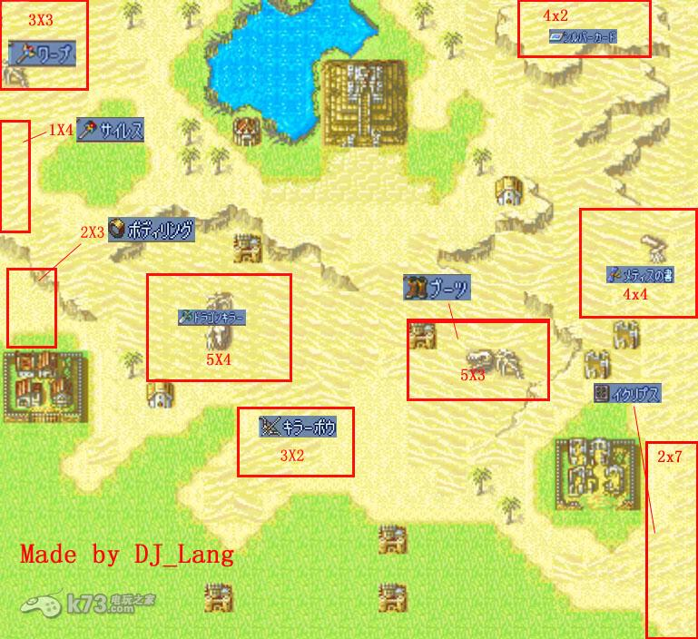

# 4 EX地图
## 4.1 塔
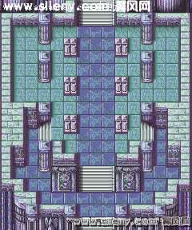

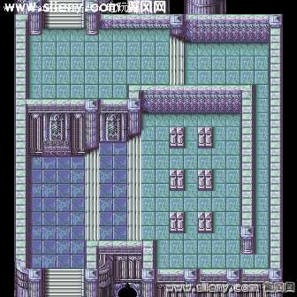

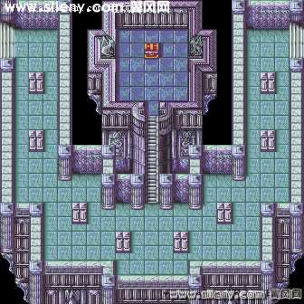

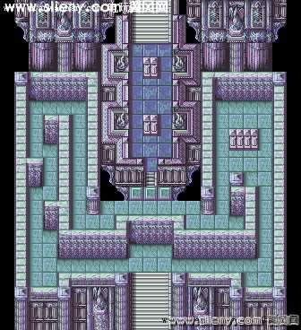

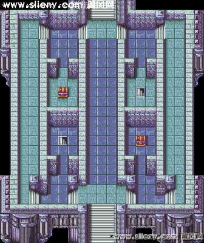

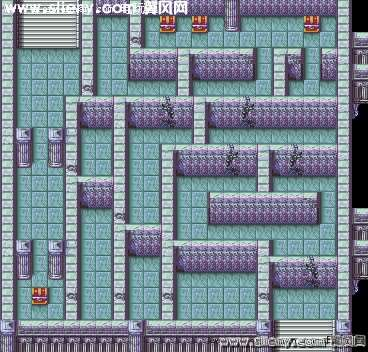

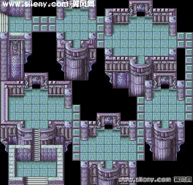

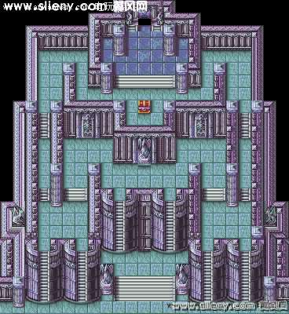

## 4.2 遗迹

整个遗迹共有10层，战斗内容非常简单，就是全灭魔物们，这之中最大的问题就是各层之间是无法记录的，另外，由于敌人为数众多，武器道具的消耗量也非常惊人，建议在战前就作好充分准备，主角的输送队功能这时可以大派用场！当然每过一层之后都可以在整备画面中访问武器店，不过里面只有一些初级武器。在战斗中随时可以选择“退却”指令回到地图画面，虽然下一次进入时又得从第一层开始功略，但之前所获得的经验值和物品是可以保留的，因此可以说是提供了一个无限练级和凹宝的场所而已。此外，还可以通过“战绩”指令来查看功略遗迹过程中的各项成果，十分方便。

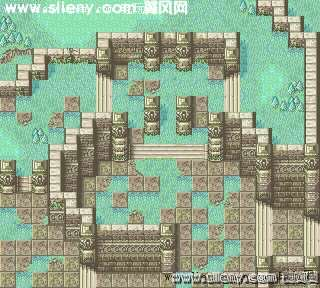

1层：没什么好说的了，毕竟只是第一层，地形也不复杂，敌人实力对于通过关的我方来说就是小菜，增援从第6回合开始出现，注意如果干掉了BOSS的话，增援的种类和数量会发生少许的变化，丝毫不需要什么战术，尽情的驱魔吧……

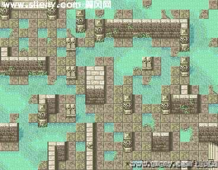

2层：敌人的数量又有所增加（初期只有50只），能力也大幅度提升，独眼巨人皮糙肉厚，攻击力很高，半人马和骷髅战士也不容小视，成群的涌来是非常可怕的，由于只能出击8名同伴，能力弱的同伴就不要带出来了。从某些敌人身上也能得到骑士勋章之类的物品以及少量的资金。只有武器足够，全灭敌人也只是时间问题，大量的经验值会让你体验飞速升级的爽快感觉。

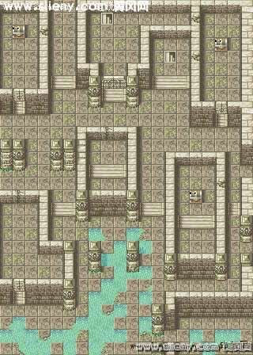

3层：比上一层的难度又有所增加，最讨厌的就是那些隔着墙壁用射程1-3的石化武器的攻击的魔物，命中率还不低，被石化的部队受到攻击很容易被造成必杀一击，最好用间接攻击甚至远程魔法尽快解决。笔者在这里遭遇不幸，连连被石化，万般无奈之下只好使用圣杖（需要提醒的是，用圣杖回复同伴的石化状态时，被回复的同伴是无法立刻行动的，这点比不上レスト），敌人的数量依然可观，还会不时从各处出现增援，除了两名主角之外的全部角色都有阵亡的危险，每次行动之前都最好精心计算，及时地回复HP仍然是长期作战的保证，能用杖的角色最好人手一根以备不时之需。强调一下，本关的几个，包括后来几层中出现的宝箱中可以出现的宝箱中可以得到的物品都是随机的。

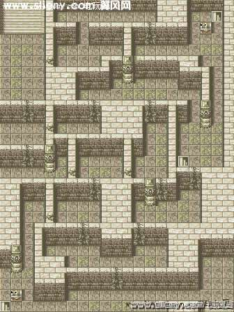

4层：本关的地形更加复杂，需要不断破坏各处的墙壁才可以前进，使用石化攻击的敌人仍是需要优先解决的对象，其余敌人的能力并不强，狭窄的通道使得遇见岔路时不妨选择分兵，对于只能依靠“人海战术”堆死我方的魔物们来说，散乱的分布在各处只会把主动权交到我方手中。本章中的两个宝箱中的物品仍是不固定的，并且敌方会有增援的盗贼试图抢占，应适当加快行军的速度。

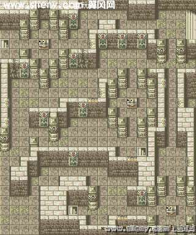

5层：又是考验耐心的一关，本关出现的都是比较难缠的敌人，道路仍旧是曲折的，一开始就选择兵分两路可以节省时间，有意思的是，本关镶有红珠的墙壁会随机喷出毒气，造成无差别的伤害，并导致中毒，而且影响的范围是直线上的3格，遗迹里果然有机关的呢。虽然这里的敌人非常强悍，但出场的我方人员大部分等级应该已经接近满级，应付他们绰绰有余，注意增援的盗贼，宝箱里的物品一被夺取就要尽快击倒他们。

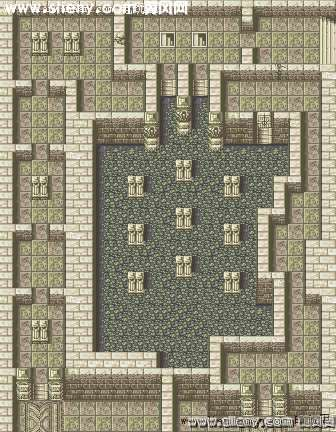

6层：一开始我方人员会被分成三部分，分别从左、中、右三个方向进攻（433？笑），可以在出击准备画面时通过调整顺序来安排角色的初始位置。三个方向的敌人强度基本差不多，只要注意左侧大眼球怪的远程攻击基本不会有什么危险。上方的阶段会出现敌人的增援，不过对于中路的男女主角来说……

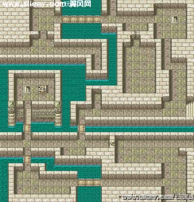

7层：和上一层一样，队员被分成三部分，不过相对的，敌人的分布也较为分散。本关的魔物大多是防御力极差的ゴ-ゴソ和ア-クビグル，因此基本上是一下一个的，但是他们的石化和远程攻击也会给我方带来不小的麻烦，尤其是魔防较低的同伴会很吃力。第4回合开始，从各方向零散出现的增援使战斗变的比较艰苦，要注意同伴间的相互支援。

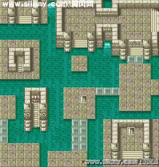

8层：这一层开始我军被孤立在左下角的狭窄区域内，之后需要通过逐渐出现或消失的连接各部分的石板才能到达各处，因此，飞行部队是最主要的战力，尤其是高回避、高魔防的天马骑士会相当活跃，尽量多派些上场吧（很有趣的是召唤出来的HP只有1的亡灵战士居然可以“水上行走”，不妨多弄一些出来做炮灰）。敌方自然是以飞行系的デスガ-ゴイル为主，攻、防、HP都比较高，另外大眼球怪的魔法威力也是很惊人的，战斗会显得比较被动。不过只要之前几名飞行系角色培养的好应该不会有很大难度。

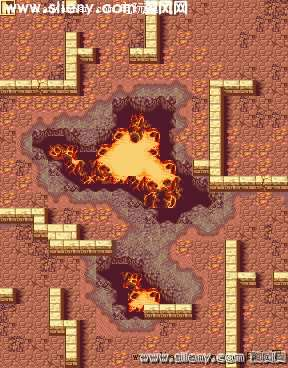

9层：一下子从水域来到了火山谷，遗迹内部果然是别有洞天啊。这次的敌人中，没什么特点的骷髅战士和少量的独眼巨人并不难应付，大使大量使用远程魔法的大眼球怪确是最麻烦的敌人，注意HP的回复。地面会随机喷出火焰，不过好象敌方中招的次数比较多……

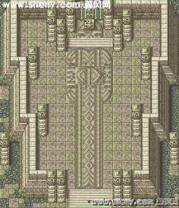

10层：终于到达遗迹的最后一层了，虽然敌人只有10条僵尸龙，但是吐息无视防御的特性加上超高的HP是相当难缠的，而且他们的命中率也高的吓人，无法承受他们一次攻击的角色还是不要上场了。对于防御超高的尸龙来说，最有用的攻击应该是无视防御的ルナ和对魔物特效的司祭，至于瞬杀和贯通都要考虑发动概率而有更多风险。先集中火力，用ルナ和司祭干掉右上方的两条尸龙，然后注意对方的可攻击方法，先让司祭使用远程光魔法削左上方两条尸龙的HP，待到少到一定程度再一次干掉。围攻干掉BOSS后可获得最宝贵的金の宝玉，下面的尸龙过于集中，继续使用远程光魔法是最安全的做法，当然进入遗迹前要购买足够数量的……

# 5 参考资料
1.  [圣魔之光石图文攻略](https://www.wyaq.com/youxi/gonglue/9507_11.html) 
2.  [圣魔之光石人物转职](https://wenda.so.com/q/1447891638729190) 

